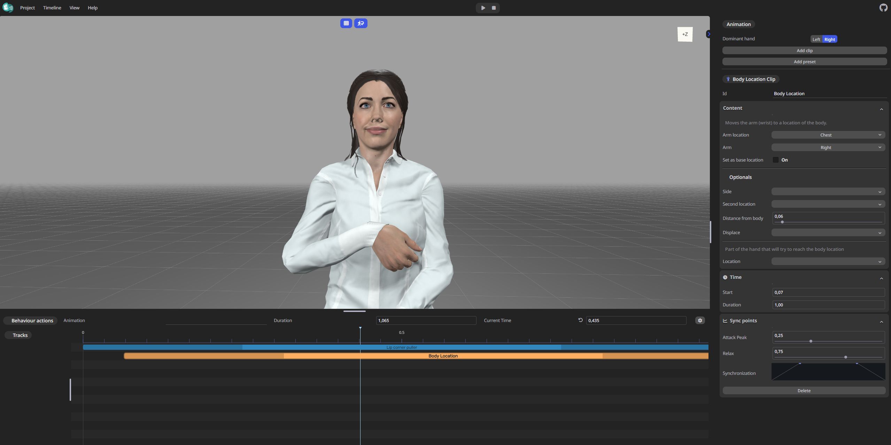
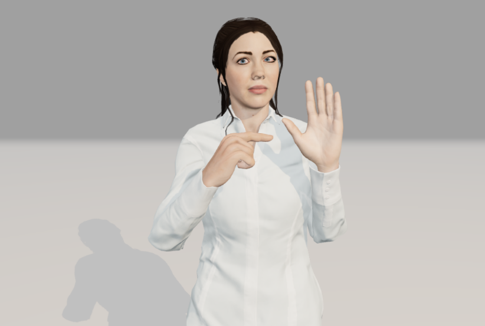

# Avatar Synthesis

This component is the the sinthesis module for the [SignON Project](sign.on.website), an EU H2020 research and innovation funded project.

Two applications were developed within the SignON project.
- The first, SignON Editor, is a web-based system that allows users to generate and edit sign animations. These animations are built using a phonetic approach, which allows grammatical information to be imbued into the final message. It is also connected to previosly-crafted repositories of signs, so users can reuse signs to build more complex messages such as a combination of signs or utterances. The main repository of this work can be found [here](https://github.com/upf-gti/SignON-editor).

  

- The second, SignON Realizer, is the 3D engine that contains all the avatar movement from a phonetic representation input. This acts as the core of the previous application, and it is also used in the SignON mobile application. This application is also prepared to execute animations from glosses, by using a mapping between a gloss to the corresponding phonetic representation. By now, due to the lack of existing data, we are restricted to Dutch Sign Language (NGT). The main repository of this work can be found [here](https://github.com/upf-gti/SignON-realizer).

  

## Getting Started
The following explanation will only cover the use of the synthesis module used in the SignON mobile App. The repositories mentioned above are web-based, which means that they can be accessed at any time without any requirements or installation. 

### Usage
To embed all the realizer application into your app, you must include the following files and folders:

- [build/index.html](index.html)
- [build/js/](js) --> put the files inside into a folder named "js"
- [data/](/data)
- [external/](/external)

The organisation of folders and files should be as follows:

    project/
        - index.html
        - js/
            - App.js
            - BML.js
            - CharacterController.js
            - IKSolver.js
            - SigmlToBML.js

        - data/
            - dictionaries/
            - imgs/
            - EvaHandsEyesFixed.glb
            - EvaConfig.json

        - external/ 
            - three/
            - es-module-shims.js
            - jquery-3.6.0.min.js

### Documentation
A complete documentation of the BML descriptions related to both Manual Features (MF) and Non Manual Features (NMF) into animations can be found [here](https://github.com/upf-gti/SignON-realizer/blob/main/docs/InstructionsBML.md).

## Authors
- Jaume Pozo [@japopra](https://github.com/japopra)  
- Víctor Ubieto [@victorubieto](https://github.com/victorubieto)
- Eva Valls [@evallsg](https://github.com/evallsg)

## Licence
This project is licensed under the [Apache 2.0 License](https://opensource.org/licenses/MIT).
